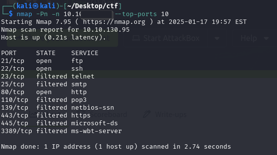
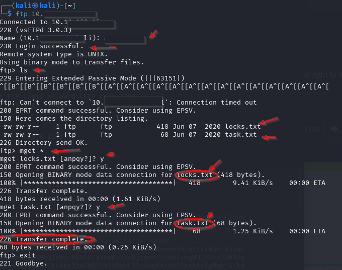
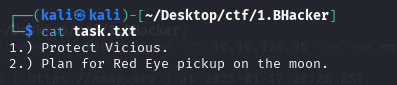
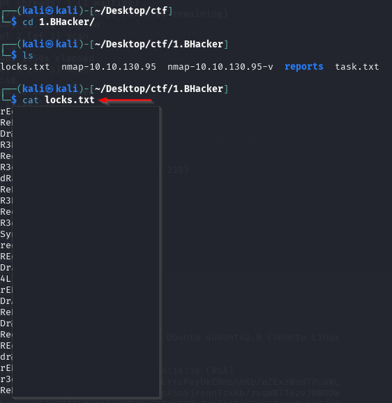
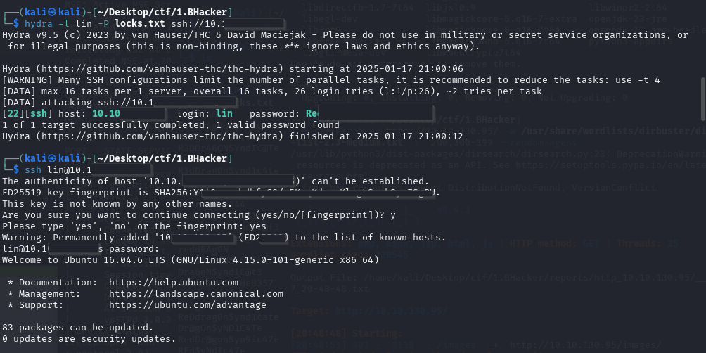
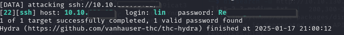
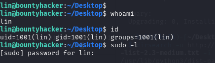
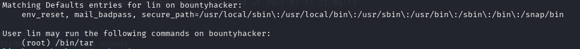
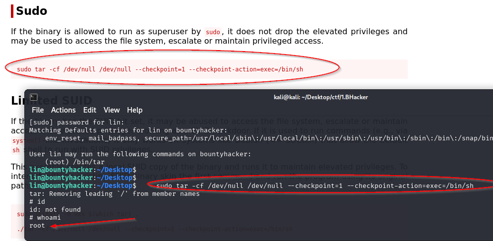
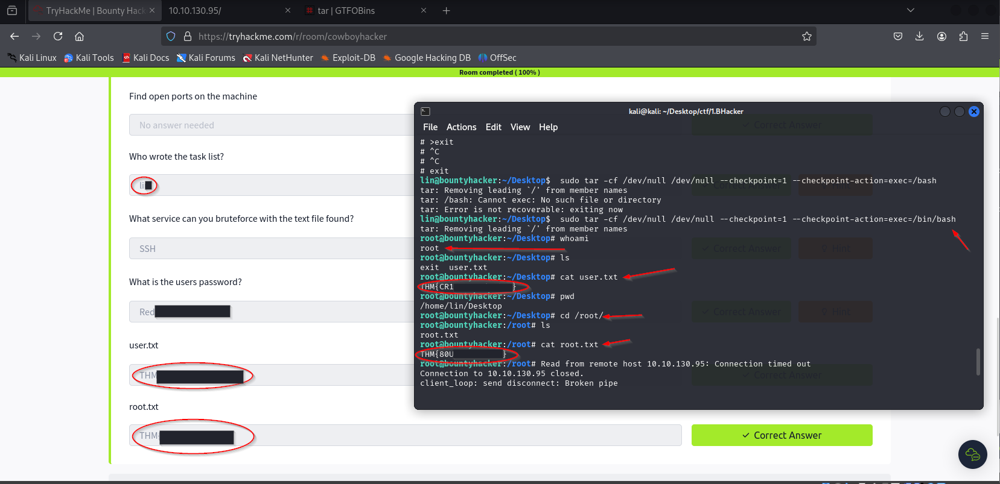

# Laboratorio TryHackMe

- Este informe documenta los pasos seguidos y los resultados obtenidos durante la resolución del reto "Bounty Hacker" en la plataforma TryHackMe. El objetivo principal fue identificar servicios abiertos, obtener credenciales mediante ataques de fuerza bruta y acceder a la información confidencial almacenada en la máquina objetivo.

# Objetivos

- Realizar un reconocimiento detallado para identificar servicios abiertos.

- Obtener credenciales válidas mediante fuerza bruta.

- Acceder al sistema remoto y recuperar las banderas "**user.txt**" y "**root.txt**".

# Herramientas Utilizadas

- Kali Linux: Sistema operativo para pruebas de penetración.

- Nmap: Herramienta de escaneo de red para descubrir puertos abiertos.

- Hydra: Aplicación para realizar ataques de fuerza bruta.

- FTP y SSH: Protocolos para acceder a la máquina objetivo.

# 1. Escaneando Redes con Nmap

- nmap -Pn -n --top-ports 1000 --open -T5 10.10......

# Servicio ftp 

- El acceso anónimo estaba habilitado por lo que pude conectarme a la maquina sin credenciales. Permitiéndome así usar "mget *".

- Lo cuál, me permitió acceder a información relevante contenida en "task.txt":

- Luego accedí a la información de "locks.txt", que contenía las contraseñas:

# Hidra
- Se llevó a cabo un ataque de fuerza bruta utilizando las credenciales obtenidas de los archivos anteriores:

- Después de obtener la contraseña válida, se estableció una conexión SSH exitosa:

- Una vez dentro del sistema, se identificó al usuario actual, lin, y se revisaron sus privilegios, los cuales indicaron que tenía permisos para ejecutar comandos como root.

- Confirmamos la posibilidad de escalada de privilegios, ya que el usuario lin tiene permisos para ejecutar /bin/tar como root.

- Utilizando la información disponible en la página GTFOBins https://gtfobins.github.io/gtfobins/tar/#sudo, se utilizó el comando tar con privilegios de sudo para ejecutar un shell con privilegios de superusuario:

- luego de haber confirmado que escalamos privilegios y somos superusuario, con el comando: "cat user.txt" conseguimos la bandera:

- Luego procedemos acambiar de directorio, concretamente al root con el siguiente comando: cd /root/ obteniendo asi la bandera que nos faltaba.

# Conclusión 
- En este laboratorio aprendí a identificar y explotar configuraciones incorrectas de privilegios dentro de un sistema, como el abuso de permisos sudo para ejecutar comandos con privilegios de root, utilizando la herramienta tar. Esto me permitió comprender la importancia de una correcta configuración de permisos y cómo una pequeña brecha de seguridad puede ser explotada para escalar privilegios a nivel de superusuario.
